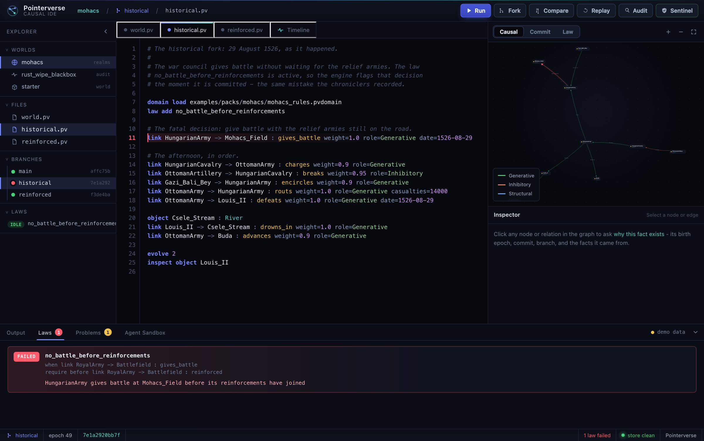
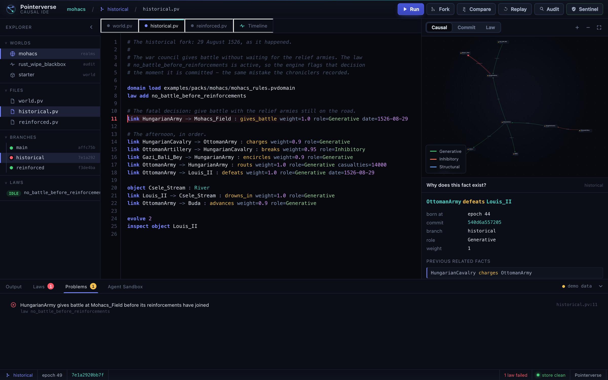
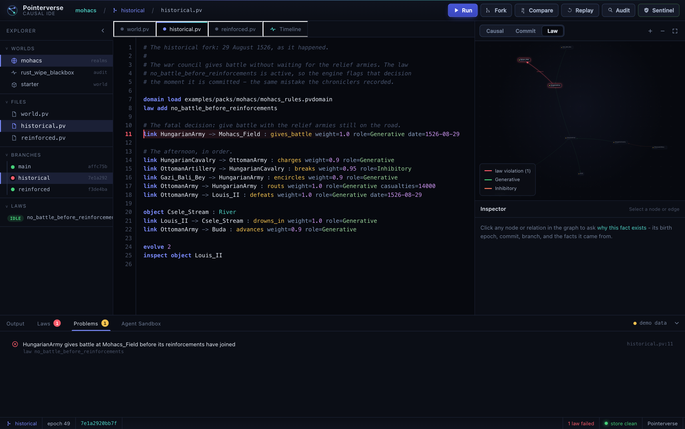
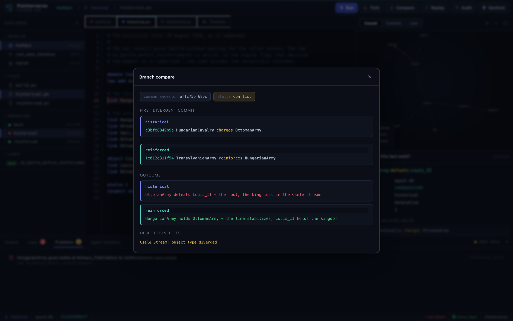
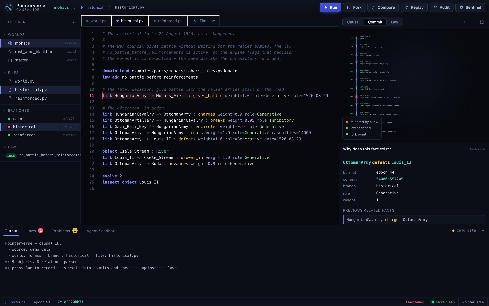
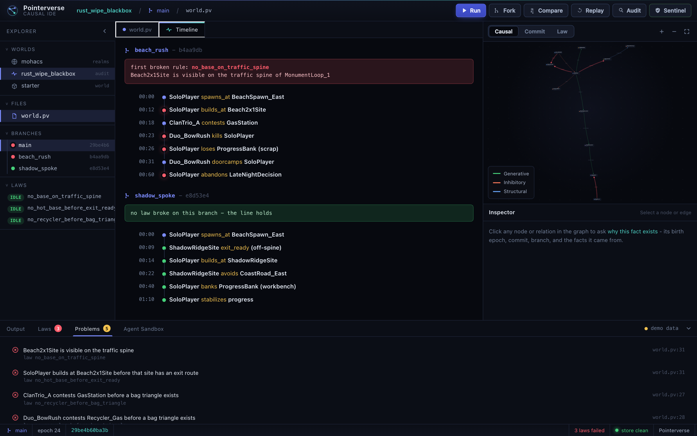
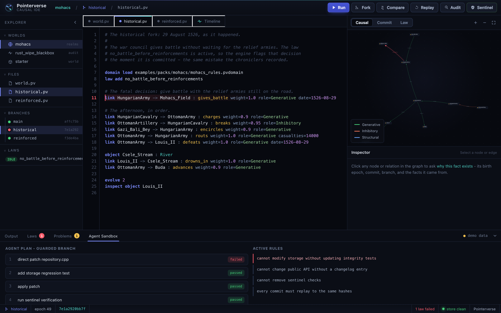

# Pointerverse

Pointerverse is a deterministic engine for verifiable worlds. You describe a
world as a program, run it into content-addressed commits, fork it into
alternate histories, and let typed laws check every transition. Then you can
query the graph, ask why a fact exists, compare two branches, and replay the
entire store bit for bit.

In one line: version control for branching worlds. Fork a world, record the
consequences, and check every step against your laws.

```txt
World scripts / event logs / apps -> Kernel VM -> Runtime -> Store -> Sentinel
```

## The workbench

Pointerverse ships with a browser workbench - a causal IDE for forkable worlds.
You write a world on the left, watch it become a typed graph on the right, run it
into commits, and read the law check below. It is the same engine underneath; the
UI is one more surface over it.



Above, the `historical` fork of Mohács gives battle before its relief armies
arrive, so the law `no_battle_before_reinforcements` fails the moment it is
committed - a compiler error for a world, not for code. The status bar reads
`1 law failed`; the offending line is flagged red in the editor and in the graph.

<table>
<tr>
<td width="50%"><br><b>Ask why a fact exists.</b> Click any relation and read its birth epoch, commit, branch, and the earlier facts it came from.</td>
<td width="50%"><br><b>See the law break in the graph.</b> The rejected transition lights up red; the rest of the world dims around it.</td>
</tr>
<tr>
<td><br><b>Compare two afternoons.</b> The common ancestor, the first divergent commit, the outcome of each branch, and the object conflicts.</td>
<td><br><b>Read the content-addressed history.</b> The commit DAG for a branch, with the rejected transition marked in red and the fork point in teal.</td>
</tr>
<tr>
<td><br><b>Find where it first broke.</b> A solo Rust wipe day charted branch by branch - the hot beach base that lost the night, and the off-spine line that held.</td>
<td><br><b>Guard an agent's changes.</b> Proposed edits run on a forked world and must clear your laws before they ever touch the real repository.</td>
</tr>
</table>

### Run the workbench locally

The workbench is static files plus a small standard-library server - no build
step and no npm install. From the repository root:

```sh
# Demo data only - renders everything above, needs nothing but Python 3
python3 -m http.server 8787 --directory ui
# then open http://localhost:8787
```

To drive the panels with the real engine, build the binary first; Run, Why,
Compare, Replay, Audit, and Sentinel then call actual `pointerverse` commands and
fall back to the demo data when one is unavailable:

```sh
cmake --build build
python3 ui/serve.py            # serves http://localhost:8787, binds localhost only
```

See `ui/README.md` for the file layout.

## What it does - and what it doesn't

Pointerverse **records and checks**; it does not predict. The history you give
it - a `.pv` script, an ingested event log - is authored by you. The engine's
job is to (a) check that authored history against the laws you declared and
(b) make it content-addressed and replayable, so anyone can reproduce it
exactly and detect tampering.

In the Mohács and city packs the outcomes - the rout, the king lost in the
stream, the flood - are written by hand in the fork scripts (see
`examples/packs/city/flood.pv`). The engine does not derive them. What it adds
is verification and reproducibility: the counterfactual is consistent with the
declared laws, and the whole transcript replays to the same hashes.

So "proof" here is precise: a commit's proof is a Merkle commitment to its
transcript - an integrity and reproducibility guarantee - not a proof of a world
property. The category layer's laws (associativity and identity of morphism
composition) are property-tested in `tests/category/category_tests.cpp`; the
demos are checked, reproducible records, and they say so.

## The model

- A **world** is a typed, directed graph of objects and relations, indexed by
  epoch. Objects carry typed attributes; relations carry weight, a causal role,
  and a validity interval.
- The only way a world changes is a **delta**: a batch of operations compiled to
  a program, executed by a deterministic VM, checked by active laws, and then
  committed.
- Every commit is **content-addressed** - objects, delta, before/after
  snapshots, and a proof - so a history is a Merkle DAG you can replay, fork,
  diff, and verify. It is git's data model applied to graph-worlds.
- **Laws and rules** reject a transition that breaks your constraints before it
  is committed, in strict mode, or record it for audit in observe mode.
- **Observers** project measurable views; the world is never printed raw.

The same engine drives every surface: Worlds and Realms, the forkable Repo,
Guard for code diffs, Audit for event logs, and the Sentinel runtime.

## Replay-backed interventions

Breakpoints are measured through an intervention space, not by assigning a
standalone weight. Pointerverse builds canonical operator families over exact
dyadic scales, refines them deterministically, replays the resulting programs,
and records where an equivalent breakpoint survives or dies. A breakpoint's
severity is induced by the lowest-cost intervention program that kills it, while
the filtration records birth scale, death scale, persistence, surviving regions,
and evidence carried across scales.

```sh
./build/pointerverse intervention families main <breakpoint-id>
./build/pointerverse intervention refine main <breakpoint-id> --depth 4
./build/pointerverse intervention search main <breakpoint-id> --max-depth 4 --max-composition 2
./build/pointerverse intervention trace main <search-id>
./build/pointerverse intervention compose main <breakpoint-id> <left-id> <right-id>
```

Traces are derived views: they are recomputed from branch history, laws, deltas,
and content-addressed commits rather than persisted as cache truth.

## Build

Pointerverse uses C++23, CMake, Ninja, and vcpkg manifest mode.

```sh
export VCPKG_ROOT=/path/to/vcpkg
cmake --preset default
cmake --build --preset default
ctest --preset default
```

To build only the engine and CLI:

```sh
cmake -S . -B build -G Ninja \
  -DCMAKE_TOOLCHAIN_FILE=$VCPKG_ROOT/scripts/buildsystems/vcpkg.cmake \
  -DPOINTERVERSE_BUILD_TESTS=OFF
cmake --build build
```

## Sixty seconds: fork a real history and check it

The flagship pack builds the Battle of Mohács, 29 August 1526, from the
historical record - real commanders, real numbers, the real date - then forks it
into the two afternoons: the one that happened, and the one where the war
council waits for its relief armies.

```sh
./build/pointerverse pack run mohacs
```

The baseline arrays both armies and puts the Transylvanian and Croatian relief
armies on the road. One law states the decision the council faced:

```txt
rule no_battle_before_reinforcements
when link RoyalArmy -> Battlefield : gives_battle
require before link RoyalArmy -> Battlefield : reinforced
```

The `historical` fork gives battle early, so the engine rejects that commit on
the spot - the same mistake the chroniclers recorded - and the rout, the king in
the Csele stream, and the fall of Buda follow, all authored in the fork script.
The `reinforced` fork waits for the relief armies, the same law passes, and the
line holds. Then you read the divergence back out of the store:

```sh
./build/pointerverse repo --store examples/packs/mohacs/.pack-store \
  why historical OttomanArmy defeats Louis_II
./build/pointerverse repo --store examples/packs/mohacs/.pack-store \
  branch compare historical reinforced
./build/pointerverse repo --store examples/packs/mohacs/.pack-store fsck
```

`branch compare` names the first commit where the two afternoons diverge.
`fsck` confirms the whole store is intact and replayable. The history is real;
the counterfactual is the point. Mohács is a thin slice of a deeply documented
campaign - the pack is meant to be extended.

## Write your own world

A `.pv` script is a small line-oriented language. Objects and relations carry
typed attributes, so a world reads like a ledger:

```txt
object Reactor : Plant capacity_mw=1100 commissioned=1984
object Grid : Network
link Reactor -> Grid : powers weight=0.9 role=Generative since=1984

law add bounded_weight
evolve 1
inspect object Reactor
```

Run it, persist it to a repository, fork it, and inspect the result:

```sh
./build/pointerverse world run my_world.pv
./build/pointerverse repo init .pvstore
./build/pointerverse repo --store .pvstore run my_world.pv --branch main
./build/pointerverse repo --store .pvstore branch fork main what_if
./build/pointerverse repo --store .pvstore explain main commit <hash>
```

`explain commit` prints the exact delta a commit applied and how each law stood.

## Compute in `.pv`

Worlds are not only authored edge by edge. A domain file (`domain load`) can
declare computation that the engine runs deterministically:

- **Derivations** are bounded forward-chaining rules. Body atoms are joined on
  shared variables and the head edge is produced for every binding, run to a
  fixpoint by `evolve`. This expresses relational closures - reachability,
  transitive citation - that a single-hop rule cannot:

  ```txt
  derive transitive_reach
  from link X -> Y : reaches
  from link Y -> Z : reaches
  make link X -> Z : reaches role=Structural weight=1.0
  ```

  ```sh
  ./build/pointerverse world run examples/derivation.pv
  ```

  Re-running `evolve` recomputes the same closure from the authored graph, so it
  is idempotent. Derivations close over edges, not arithmetic; they are a small
  Datalog-style step, not full logic programming.

- **Endpoint binding** lets a rule's `require`/`forbid` look beyond the trigger's
  own endpoints. Prefix an endpoint with `~` to match any object instead of the
  trigger's from/to, so two-edge and third-object constraints become expressible:

  ```txt
  rule no_modify_while_any_quarantined
  when link Agent -> File : modifies
  forbid exists link Agent -> ~File : quarantined
  deny reason "{from} modifies {to} while holding a quarantined file"
  ```

  Path constraints across many hops are expressed by *deriving* the closure
  edges (above) and then checking them, not inside one rule.

- **Morphisms** transform the objects they apply to, beyond retyping. A `set`
  action recomputes a numeric attribute; an `emit` action creates an edge:

  ```txt
  morphism promote : Junior -> Senior
  set level = level + 1
  emit self -> Board : reports_to weight=0.5 role=Generative
  ```

Custom rules, derivations, and a schema can be packaged into one domain file and
shared with `domain load`.

## Surfaces

Surfaces are applications of the one engine. List them with `surfaces` and open
one with `surface show <name>`.

- **World / Realms** build and fork worlds: `pack run mohacs`, `pack run city`,
  `world run`, `world repl`.
- **Repo** stores forkable histories with `run`, `branch`, `query`,
  `query-file`, `explain`, `why`, `branch compare`, and `fsck`.
- **Guard** turns a code diff into graph evidence and a PR risk report:

  ```sh
  ./build/pointerverse guard run --repo examples/packs/code_review/after \
    --base ../before --format markdown --out audit-report.md
  ```

- **Source / Ingest / Project / Decide** turns external event streams into
  canonical events, graph commits, projections, and evidence-backed reports:

  ```sh
  ./build/pointerverse source inspect events.jsonl --format jsonl
  ./build/pointerverse source normalize events.jsonl --format jsonl --out canonical.jsonl
  ./build/pointerverse ingest canon canonical.jsonl --branch main
  ./build/pointerverse project timeline main
  ./build/pointerverse project entities main
  ./build/pointerverse decide report main

  ./build/pointerverse ingest agent-log events.jsonl --branch main --mode observe
  ./build/pointerverse ingest graph-log world-events.jsonl --branch main
  ./build/pointerverse audit report main
  ./build/pointerverse audit first-broke main no_pr_without_tests
  ```

- **Sentinel** boots the store through staged self-checks and patrols it:

  ```sh
  ./build/pointerverse sentinel boot .pvstore
  ./build/pointerverse sentinel patrol .pvstore --once
  ```

## Packs

Demo packs live under `examples/packs`. Each one is a self-contained world with
`pack.toml`, scripts, `run.sh`, and a README.

```sh
./build/pointerverse packs
./build/pointerverse pack run mohacs              # fork a real battle into two afternoons
./build/pointerverse pack run city                # fork a city into flood, blackout, evacuation
./build/pointerverse pack run code_review         # turn a risky diff into graph evidence
./build/pointerverse pack run rust_wipe_blackbox  # record a wipe day and find where it first broke
./build/pointerverse pack run kernel_corruption   # corrupt a proof chain and watch Sentinel catch it
```

## Architecture

Pointerverse is split into layered CMake targets:

```txt
pointerverse_kernel      pointerverse_runtime    pointerverse_storage
pointerverse_sentinel    pointerverse_query      pointerverse_rules
pointerverse_domains     pointerverse_ingest     pointerverse_guard
pointerverse_audit       pointerverse_cli_common pointerverse_sdk
```

The boundaries are enforced, not aspirational: the kernel does not include
Guard, Audit, Ingest, Sentinel, Storage, or app headers; the runtime does not
include Storage or product surfaces; Storage does not include Sentinel or
surfaces. The CLI registers each surface as a separate module.

## Guard Action

The GitHub Action wrapper is one application of the engine: it produces PR risk
reports, annotations, SARIF upload, and a replayable `.pvstore/` artifact for
every run.

```yaml
name: Pointerverse Guard

on:
  pull_request:

permissions:
  contents: read
  issues: write
  pull-requests: write
  security-events: write

jobs:
  guard:
    runs-on: ubuntu-latest
    steps:
      - uses: actions/checkout@v4
        with:
          fetch-depth: 0

      - uses: farukalpay/Pointerverse@v0
        with:
          base: origin/main
          mode: observe
          upload-sarif: "true"
```
